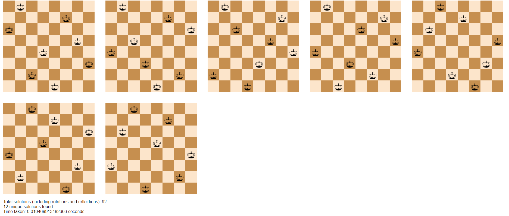

<h1> 8QueenProblemPHPimprovement </h1>

Here is x3 times faster simple solution which improves the given solution solution time from 0.3s to 0.1s and thats almost 3 times faster!
That is achieved simply by terminating the loop if we allready have 12 distinct solutions. It is a known fact that there is only 12 solutions,
so there is no point to iterate through the loops if we have all the stack :).
